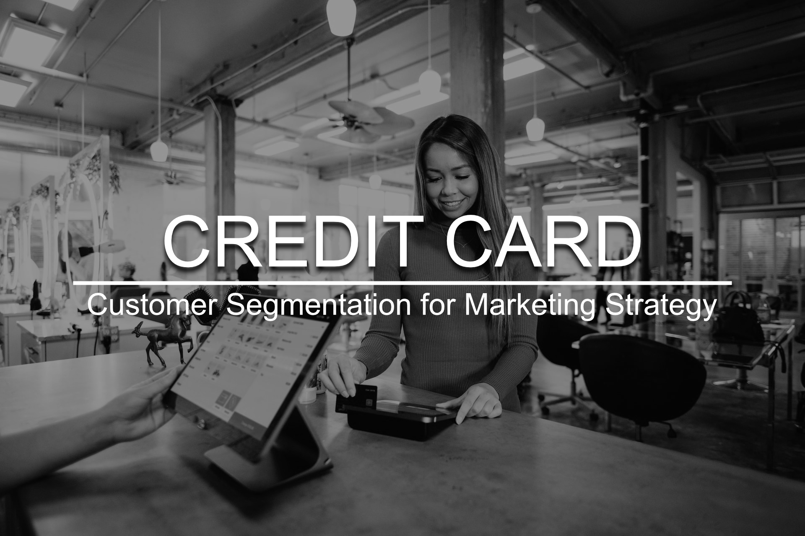
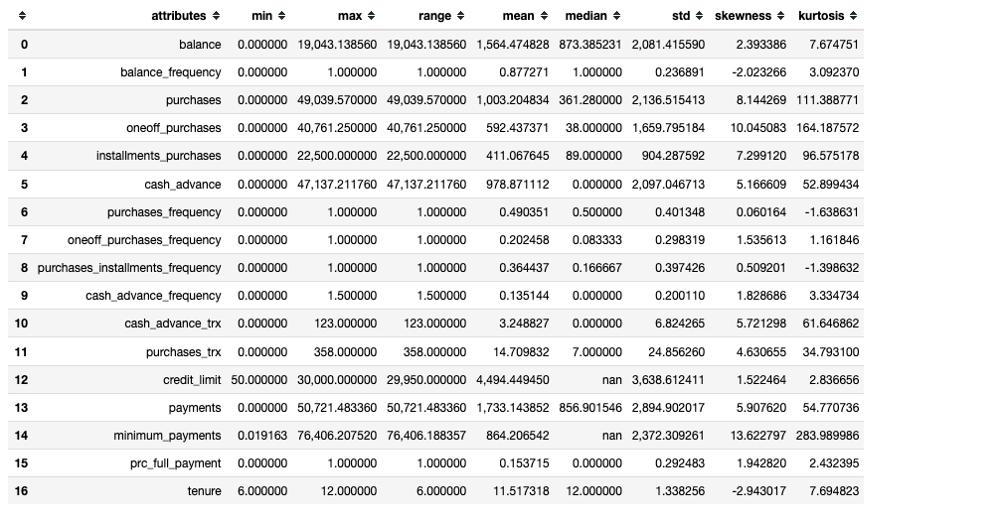
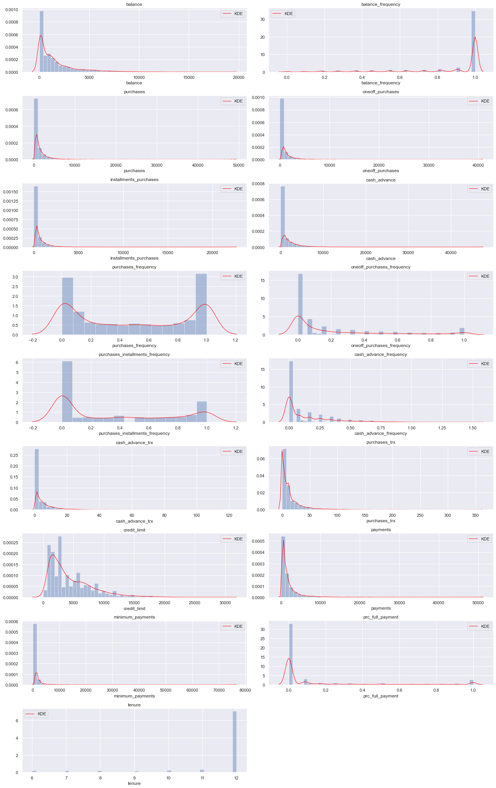
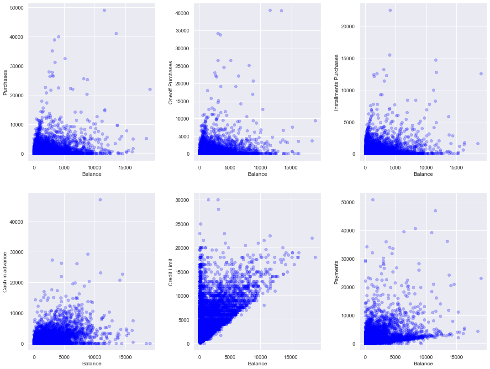
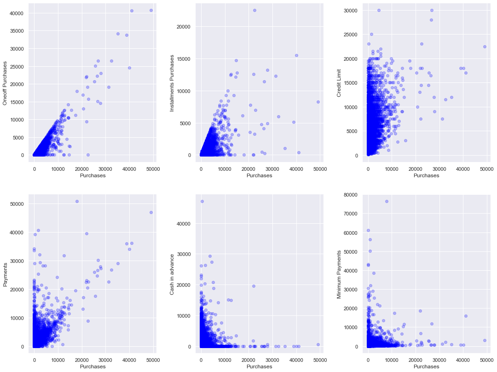
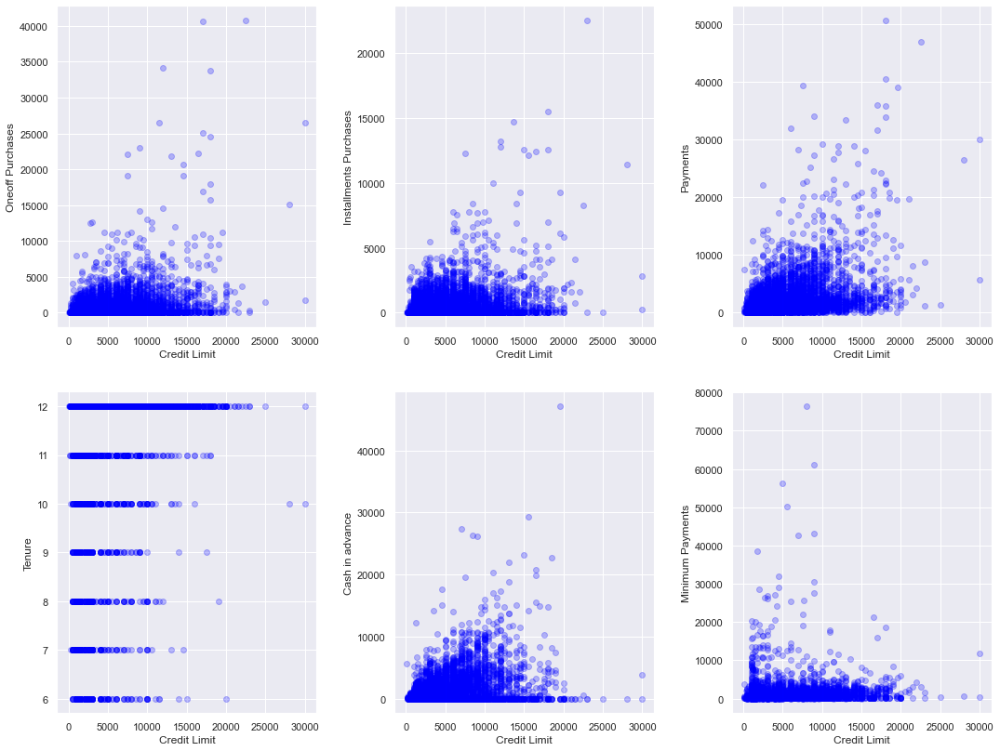
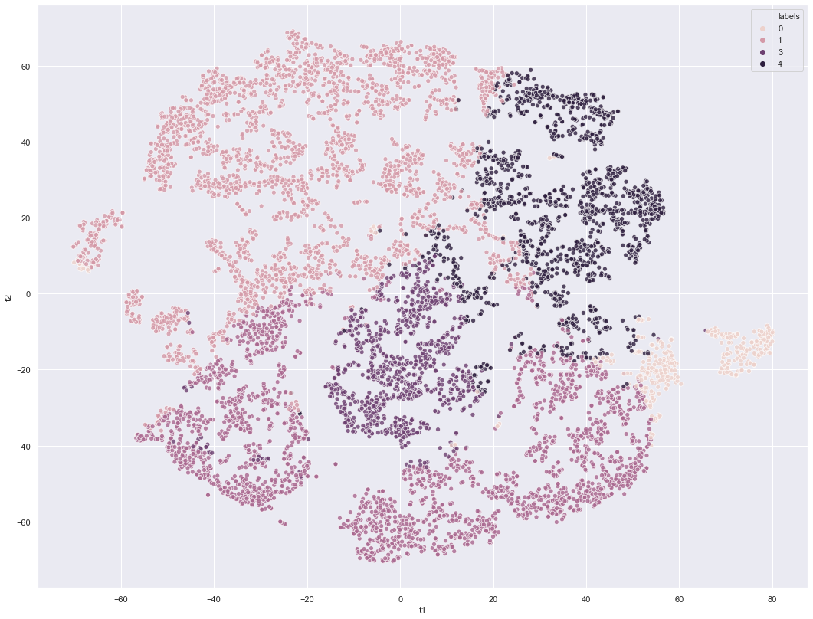
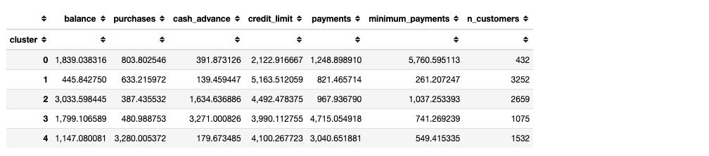
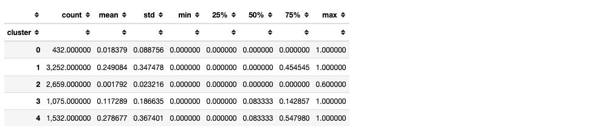

# Credit Card Clustering

## Customer Segmentation for Marketing Strategy

Photo by <a href="https://unsplash.com/@blakewisz?utm_source=unsplash&amp;utm_medium=referral&amp;utm_content=creditCopyText">Blake Wisz</a> on <a href="https://unsplash.com/s/photos/credit-card?utm_source=unsplash&amp;utm_medium=referral&amp;utm_content=creditCopyText">Unsplash</a>

# 1.0 The context

Marketing is crucial for the growth and sustainability of any business. It can help build the company’s brand, engage customers, grow revenue, and increase sales.

One of the **key pain points** for a marketing team is to know their customers and identify their needs. By understanding the customer, the team can launch a targeted marketing campaign that is tailored for specific needs. In addition, if data about the customers is available, the data science team can help performing a **customer segmentation**.

## 1.1 What Is Customer Segmentation?

Customer segmentation is the process of dividing a target market into smaller, more defined categories. It segments customers and audiences into groups that share **similar characteristics** such as demographics, interests, needs, or location.

Companies employing customer segmentation operate under the fact that every customer is different and that their marketing efforts would be better served if they target specific, smaller groups with messages that those consumers would find relevant and lead them to buy something. Companies also hope to gain a **deeper understanding** of their customers' preferences and needs with the idea of discovering what each segment finds most valuable to **more accurately** tailor marketing materials toward that segment.

PS 1: All the references are stated at the end of this README.

PS 2: You can find useful information at **section 1** of my [notebook](https://www.google.com).

 

# 2.0 The challenges

- Banks always have extensive data on their customers, but they don't know what to do with it.
- The marketing team at the bank wants to launch a targeted ad marketing campaign by dividing their customers, but they lack the tools and knowledge to segment the customers.

 

# 3.0 The solution

In this project, I manage to build a model that intakes data from customers, clusters them into five different groups and extracts their main characteristics in order to prescribe a business marketing strategy.

 

## 3.1 What drove the solution

### 3.1.1 Exploratory Data Analysis

#### Descriptive Analysis

As observed, almost all features presents a distribution that is highly skewed with heavy tails. This means that there is many data that is far from the mean. However, we can't really say that there are outliers in our data, thus, we can't get rid of them because they may represent a cluster of customers that can be valuable for further analysis.

In addition, as we aren't making any classification nor regression, the outliers may be an interesting cluster to analyze and help us design a marketing strategy for this group of customers.

 

#### Univariate Analysis

Key points:

- The balance frequency for most customers is updated frequently.
- For purchases frequency, there are two distinct group of customers.
- Most customers don't do one off purchases or installment purchases frequently.
- Most customers don't do cash in advance.
- Very small number of customers pay their balance in full.
- Most customers are 11+ years tenure.

 

### 3.1.2 Bivariate Analysis

#### Balance

As observed, most customers have balance up to 10,000 and:

- Make purchases up to 10,000
- Make one off purchases up to 5,000
- Make installments purchases up to 5,000
- Use cash in advance up to 10,000
- Have credit limit up to 15,000
- Make payments up to 10,000

#### Purchases

As observed, most customers make purchases up to 10,000 and:

- Make one off purchases up to 10,000
- Make install purchases up to 5,000
- Have all sorts of credit limit up to 20,000
- Make payments up to 20,000
- Use cash in advance up to 10,000
- Make minimum payments up to 10,000

#### Credit Limit

As observed, most customers have credit limit up to 20,000 and:

- Make one off purchases up to 5,000
- Make installments purchases up to 5,000
- Make payments up to 10,000
- Use cash in advance up to 10,000
- Make minimum payments up to 5,000

 

### 3.1.3 Machine Learning

**Algorithm used:** K-Means with 5 clusters.

#### Performance Metrics

| Metric            | Score      |
| ----------------- | ---------- |
| Silouette         | 0\.3599    |
| Davies Bouldin    | 1\.0830    |
| Calinski Harabasz | 3367\.7952 |

#### Clusters

 

## 3.1 Business Performance

### Profiling the clusters

**General characteristics**

**Percentages of credit card invoice payment**

**CLUSTER 0:**

- Considerably good value for balance.
- **Customers with lowest credit limit**.
- Greater value for minimum payments.
- **Customers that when they have to pay the minimum, they pay.**
- Fewer customers.

**CLUSTER 1:**

- **Customers who spend little**.
- Customers with the lowest expenses.
- **Lowest value for cash in advance**.
- Customers with higher credit limit.
- **Good payers**.
- Greater number of customers.

**CLUSTER 2:**

- **Highest value for balance**.
- Lowest value for purchases.
- Considerable value for cash in advance.
- **Customers who spend more and with a focus on cash in advance**.
- **Worst payers**.
- Good amount of customers.

**CLUSTER 3:**

- **Customers who spend a lot on cash in advance**.
- Customers with relatively high credit limit.
- Customers with highest value for payments.
- **Customers who use more money than credit cards to make payments**.

**CLUSTER 4:**

- Greater value in purchases with great difference from the others.
- **Customers who spend a lot on purchases**.
- Use little cash in advance.
- Considerably high value for payments.
- **Best payers**.

### Business Marketing Strategy

One idea is to apply a business strategy to one of the groups with the aim of increasing the company profit.

#### Cluster 1

The most suitable group for this would be Cluster 1, after all it has the largest number of customers, they are good payers, good credit limit, but they spend little. Our idea is to engage this group to use their credit card more.

We want these customers to spend more to increase the company profit. Suppose the strategy is to partner with a rewards company that provides benefits to the customer who uses the credit the most.

To check if our strategy was effective and use the right group, we will do the so-called AB test. We'll divide Cluster 1 customers into two groups: the control group and the test group.

The control group will remain unchanged, that is, there will be no rewards program. The test group, in a defined period, will participate in the rewards program.

At the end of the period, we'll check if the people who participated in the rewards program spent more with the card or not. So we'll have a reliable result, with customers with similar characteristics.

#### Cluster 4

Another interesting group to increase profits is cluster 4, after all they spend a lot on purchases and are the best payers. They don't have a high credit limit, but one way to further encourage credit card use is to gradually increase the limit for this group.

#### Cluster 2

For the group with the worst payers, we would have to structure another type of strategy. As they focus on cash in advance, we could launch a campaign to encourage these customers to pay their bills in our bank using cash and in exchange they would be eligible to participate in a rewards program.

 

# 4.0 Next Steps

- Plan a qualitative and quantitative research targeting a sample of each cluster to better understand the customer's behaviour.
- Execute the research plan, compile the information and present to the C-Level.
- Plan and execute co-creation workshops.

 

# References

- https://blog.alexa.com/types-of-market-segmentation/
- https://searchcustomerexperience.techtarget.com/definition/customer-segmentation
